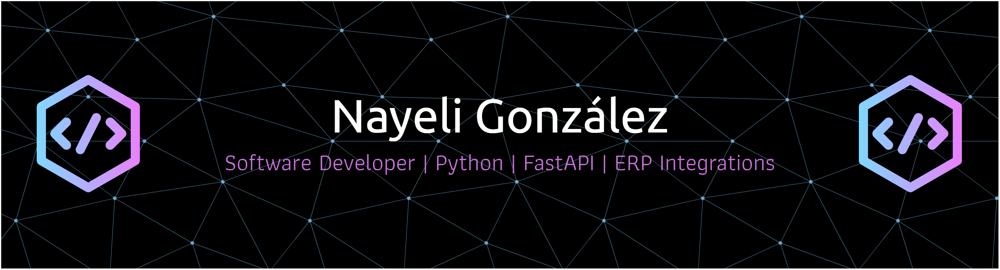

## 👋 About Me

Software Developer with 3+ years of experience building scalable backend systems, enterprise integrations, and automation solutions across enterprise environments.

I specialize in turning complex, manual workflows into efficient, production-grade systems — leveraging APIs, ERP integrations, and data pipelines to streamline operations and deliver measurable business impact.

Currently focused on backend development and system integration, driving performance, scalability, and automation across critical business processes.

- 🔗 ERP Integrations (SAP, ADM Cloud)
- ⚙️ Backend Development with FastAPI
- 📊 Data pipelines & API architecture
- 🔄 Process automation & operational efficiency
## 🛠️ Tech Stack

### 💻 Backend

---

### 🎨 Frontend

---

### 🏢 SAP & Enterprise

---

### ⚙️ Cloud & DevOps

---

### 🧠 Low-Code / Automation

---

### 🗄️ Databases

## 🚀 Featured Projects

---

### ⚡ Polaris — Energy Billing & Monitoring System (2023–2025)

> Automated energy billing for a power generation company, eliminating manual Excel-based workflows.

- Built a modular billing engine that reduced processing time from **days → minutes**
- Implemented multi-source data pipelines with real-time monitoring
- Developed distributed processing workflows deployed in production
- Integrated directly with **SAP IS-U**, eliminating manual financial entries

---

### 🏢 Impulsa — ERP Implementation (ADM Cloud)

> Digital transformation project implementing a corporate ERP system across business operations.

- Contributed to a **24-week ERP implementation project**
- Supported system configuration, integration, and validation aligned to business processes
- Integrated existing systems using **APIs, SQL, and JSON**
- Coordinated with stakeholders for testing, requirements, and deployment
- Improved process efficiency and data traceability

---

### 🔗 ERP Integration — ADM Cloud ↔ Presto

> Bidirectional integration for project and budget management between ERP systems.

- Designed and implemented **bidirectional ERP integration**
- Transformed complex structures (chapters, tasks, resources) into ERP-compatible models
- Developed backend services with **FastAPI** and REST API consumption with authentication
- Performed data validation and normalization using MongoDB
- Reduced manual budget upload processes through automation

---
## 📊 GitHub Stats

